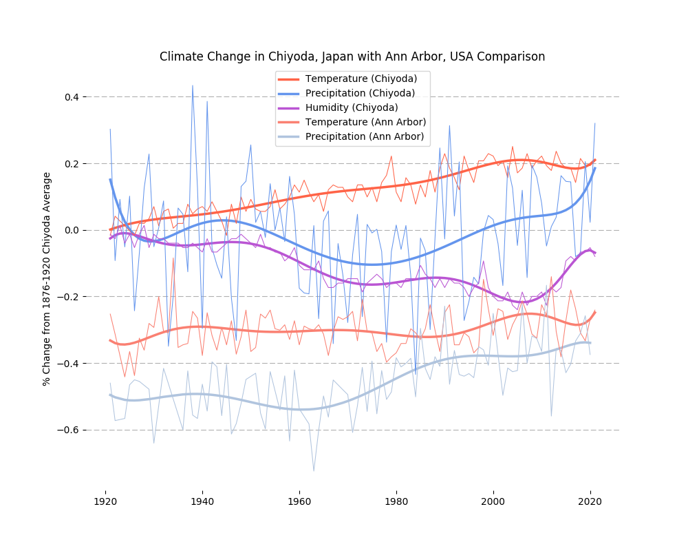

# Vizualisation of Climate Data Recorded in Chiyoda, Japan

By James Kowalik

Completed as assignment 4 in the *Applied Plotting, Charting & Data Representation in Python* course by University of Michigan

### Region and Domain
The designated region for my report is *Chiyoda, Chiba, Japan* and the stated area of investigation is *Weather Phenomena*.

### Research Question
How have air temperature, total precipitation and relative humidity changed in Chiyoda, Japan over the last century and how do they compare to Michigan, USA?

### Links
The data I used was taken from the official website of the *Japan Meteorological Agency* as monthly average climate measurements are recorded and posted on there in tabular form. From the following the links the data was copied into a CSV excel file and subsequently loaded in.

- Source = [https://www.data.jma.go.jp/obd/stats/data/en/smp/index.html](https://www.data.jma.go.jp/obd/stats/data/en/smp/index.html)
- [Monthly mean air temperature](https://www.data.jma.go.jp/obd/stats/etrn/view/monthly_s3_en.php?block_no=47662&view=1)
- [Monthly total precipitation](https://www.data.jma.go.jp/obd/stats/etrn/view/monthly_s3_en.php?block_no=47662&view=13)
- [Monthly mean relative humidity](https://www.data.jma.go.jp/obd/stats/etrn/view/monthly_s3_en.php?block_no=47662&view=7)

For the Michigan data I performed a similar process where the data was gathered from the below website (where various interactive steps are performed on the site to eventually access the specific pages).

- Source = [https://www.weather.gov/](https://www.weather.gov/)

### Image


### Discussion
The objective of this graphic was to show how various climate elements have changed in the last century. In order to show these various elements (all being measured in different units) on the same graphic, I chose to measure the data in how it compared to the pre-1920 average. Prior to 1920, there is enough data for this to be a reasonable comparison point whilst the large impact of human activity on the climate is generally acknowledged as being after this time.

Some of the most notable observations are
- There has been a very clear steady and consistent increase in temperature in Tokyo. 
- Michigan is over 40% cooler than Tokyo.
- Total precipitation is easily the most variable of the three elements.
- There appears to be some correlation (at times) between humidity and precipitation in Tokyo.
- It's difficult to judge exactly over the whole century however there at least appears to be an consistent increase in precipitation over the last 40 years in Tokyo.
- Michigan shows a more general and longer period of increase in precipitation.
- Changes in annual average temperature fluctuate more greatly in Michigan than they do in Tokyo.
- Average annual humidity was on a general downward trend over the last century until 20 years ago.

I have included the raw data (thinner lines) as well as the polynomial fit (thicker lines). This is so that the viewer can comfortably observe the trends whilst also not having any data 'hidden' from them. In doing so it is also possible to see the differences in amount of fluctuation in the various climate elements. One potential failing of the graphic could be the 'ink-ratio' as the lines and legends lead to the graphic appearing a little 'full'. However, in line with the previously mentioned points and the effectiveness at answering the research question, I believe the amount of 'ink' used to be necessary. 

Cairo's principles of truthfulness, functionality, beauty, and insightfulness were considered in the making of this plot. Truthfulness is established by not obscuring or hiding any data (i.e. including the raw data with the thinner lines) whilst using data from the most reliable available sources. Functionality is achieved by displaying the data with line graphs (as this best shows growth and decline) whilst the trend (polynomial fit) lines provide clear illustration to benefit the viewer and provide an appropriate answer to research question. Beauty is established with effective coloring and removal of borders and such where needed. Insightfulness is achieved with the lines showing clear growth and giving a concrete indication as to how much climate change has affected these elements in the last century. For further insightfulness, the inclusion of the ann arbor data provides a clear comparison for the viewer to gauge a better reading as to how the weather in Chiyoda, Japan might actually be like.


### Code
First I load in the data for Chiyoda, remove characters, and then create new datasets where the only variables are year and difference from the average (up to 1920). 

```python
import pandas as pd
import re
import numpy as np
import matplotlib.pyplot as plt
%matplotlib notebook

tempdata = pd.read_csv("monthly mean temp.csv", skiprows=[1, 148])
def remove_chars(s):
    return re.sub('[^0-9.-]+', '', s)
for i in tempdata.columns :
    if np.array_equal(tempdata[i], tempdata[i].astype(str)) :
        tempdata[i] = tempdata[i].apply(remove_chars).astype(float)

precdata = pd.read_csv("monthly precipitation.csv", skiprows=[0,2,149,150])
for i in precdata.columns :
    if np.array_equal(precdata[i], precdata[i].astype(str)) :
        precdata[i] = precdata[i].apply(remove_chars).astype(float)

humdata = pd.read_csv("monthly humidity.csv", skiprows=[0,148, 149])
for i in humdata.columns :
    if np.array_equal(humdata[i], humdata[i].astype(str)) :
        humdata[i] = humdata[i].apply(remove_chars).astype(float)

tempmean = tempdata[0:45]['Annual'].mean()

tempchng = pd.DataFrame(columns=['Year', 'ChngfrmAvg'])
for i in range(45,len(tempdata)):
    avchng = (tempdata.iloc[i]['Annual']-tempmean)/tempmean
    y = {'Year': tempdata.iloc[i]['Year'], 'ChngfrmAvg': avchng}
    y = pd.DataFrame(y, index=[i])
    tempchng = tempchng.append(y)

precmean = precdata[0:45]['Annual'].mean()

precchng = pd.DataFrame(columns=['Year', 'ChngfrmAvg'])
for i in range(45,len(precdata)):
    avchng = (precdata.iloc[i]['Annual']-precmean)/precmean
    y = {'Year': precdata.iloc[i]['Year'], 'ChngfrmAvg': avchng}
    y = pd.DataFrame(y, index=[i])
    precchng = precchng.append(y)
    
hummean = humdata[0:45]['Annual'].mean()

humchng = pd.DataFrame(columns=['Year', 'ChngfrmAvg'])
for i in range(45,len(humdata)):
    avchng = (humdata.iloc[i]['Annual']-hummean)/hummean
    y = {'Year': humdata.iloc[i]['Year'], 'ChngfrmAvg': avchng}
    y = pd.DataFrame(y, index=[i])
    humchng = humchng.append(y)
```


Here I perform a very similar process for the Ann Arbor data, this time needing to convert from Farenheit to Celcius and Inches to Milimeters and to remove missing data in the precipitation set (marked M).
```python
tempdataAA = pd.read_csv('ann arbor monthly mean temp.csv', 
                         skiprows=[0,2, 143, 144, 145, 146, 147])
tempdataAA.set_index('Year', inplace=True)
tempdataAA = pd.DataFrame((tempdataAA['Annual']-32)*(5/9))
tempdataAA = tempdataAA.reset_index()

precdataAA = pd.read_csv('ann arbor monthly total precipitation.csv',
                        skiprows=[0, 144, 145, 146, 147, 148])
precdataAA = precdataAA[~(precdataAA['Annual'] == 'M')]
precdataAA.set_index('Year', inplace=True)
precdataAA = pd.DataFrame(precdataAA['Annual'].astype(float)*25.4).reset_index()

tempchngAA = pd.DataFrame(columns=['Year', 'ChngfrmAvg'])
for i in range(39,len(tempdataAA)):
    avchng = (tempdataAA.iloc[i]['Annual']-tempmean)/tempmean
    y = {'Year': tempdataAA.iloc[i]['Year'], 'ChngfrmAvg': avchng}
    y = pd.DataFrame(y, index=[i])
    tempchngAA = tempchngAA.append(y)
    
precchngAA = pd.DataFrame(columns=['Year', 'ChngfrmAvg'])
for i in range(32,len(precdataAA)):
    avchng = (precdataAA.iloc[i]['Annual']-precmean)/precmean
    y = {'Year': precdataAA.iloc[i]['Year'], 'ChngfrmAvg': avchng}
    y = pd.DataFrame(y, index=[i])
    precchngAA = precchngAA.append(y)
```

Having wrangled the data to how I want it, I plot it using simple line graphs for the data with polynomial fit lines to show the trend more clearly.

```python
plt.figure(figsize=(10,8))

poly = np.polyfit(tempchng['Year'],tempchng['ChngfrmAvg'],35)
poly_y = np.poly1d(poly)(tempchng['Year'])
plt.plot(tempchng['Year'],poly_y, c='tomato', linewidth=2.5)
poly2 = np.polyfit(precchng['Year'],precchng['ChngfrmAvg'],35)
poly_y2 = np.poly1d(poly2)(precchng['Year'])
plt.plot(precchng['Year'],poly_y2, c='cornflowerblue', linewidth=2.5)
poly3 = np.polyfit(humchng['Year'],humchng['ChngfrmAvg'],35)
poly_y3 = np.poly1d(poly3)(humchng['Year'])
plt.plot(humchng['Year'],poly_y3,c='mediumorchid', linewidth=2.5)

poly4 = np.polyfit(tempchngAA['Year'],tempchngAA['ChngfrmAvg'],35)
poly_y4 = np.poly1d(poly4)(tempchngAA['Year'])
plt.plot(tempchngAA['Year'],poly_y4, c='salmon', linewidth=2.5)
poly5 = np.polyfit(precchngAA['Year'],precchngAA['ChngfrmAvg'],35)
poly_y5 = np.poly1d(poly5)(precchngAA['Year'])
plt.plot(precchngAA['Year'],poly_y5, c='lightsteelblue', linewidth=2.5)

labels = ['Temperature (Chiyoda)', 'Precipitation (Chiyoda)', 'Humidity (Chiyoda)', 
         'Temperature (Ann Arbor)', 'Precipitation (Ann Arbor)']
plt.legend(labels=labels)

plt.plot(tempchng['Year'], tempchng['ChngfrmAvg'], 
         c='tomato', linewidth=0.75)
plt.plot(precchng['Year'], precchng['ChngfrmAvg'], 
         c='cornflowerblue', linewidth=0.75)
plt.plot(humchng['Year'], humchng['ChngfrmAvg'], 
         c='mediumorchid', linewidth=0.75)

plt.plot(tempchngAA['Year'], tempchngAA['ChngfrmAvg'], 
         c='salmon', linewidth=0.75)
plt.plot(precchngAA['Year'], precchngAA['ChngfrmAvg'], 
         c='lightsteelblue', linewidth=0.75)

ax = plt.gca()
ax.spines['top'].set_visible(False)
ax.spines['right'].set_visible(False)
ax.spines['bottom'].set_visible(False)
ax.spines['left'].set_visible(False)
plt.grid(axis='y',linestyle = '--')

plt.ylabel('% Change from 1876-1920 Chiyoda Average')
plt.title('Climate Change in Chiyoda, Japan with Ann Arbor, USA Comparison');
```

### End

[https://github.com/jamesk185](https://github.com/jamesk185)


```python

```
